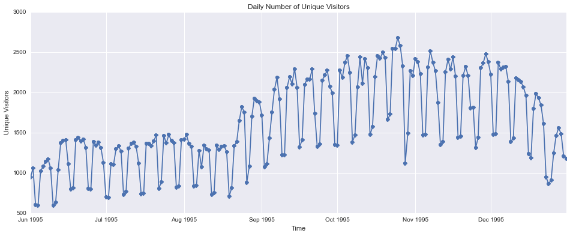

<link rel="stylesheet" href="css/monokai_sublime.css">

# Web server log file analysis using Spark

<a href='https://spark.apache.org/'>Apache Spark</a> is an open source big data processing framework built around speed and ease of use. Because of its speed and scalability Spark is well suited for processing a large collection of log files, from a web server, for example.

For this example I am going to use a dataset freely available from <a href="http://ita.ee.lbl.gov/index.html">The Internet Traffic Archive</a>. I will be using the <a href="ftp://ita.ee.lbl.gov/traces/usask_access_log.gz">Saskatchewan-HTTP trace</a>. This trace contains seven month's worth of all HTTP requests to the University of Saskatchewan's WWW server. The University of Saskatchewan is located in Saskatoon, Saskatchewan, Canada.

## RDD - Resilient Distributed Datasets
An RDD in Spark is simply an immutable distributed collection of objects. They are immutable in the sense that you can modify an RDD with a transformation that results in a new RDD whilst keeping the original RDD intact. Immutability guarantees consistency. More about RDDs can be found from this <a href="http://www.cs.berkeley.edu/~matei/papers/2012/nsdi_spark.pdf">paper.</a>

<pre><code class="python">#Read the raw log file(s)
rawLogsRDD = sc.textFile('/home/tony/Desktop/usask_access_log.gz')
rawLogsRDD.first()
</code></pre>
<pre>
u'202.32.92.47 - - [01/Jun/1995:00:00:59 -0600] "GET /~scottp/publish.html" 200 271'
</pre>

The logs are an ASCII file with one line per request, with the following columns:

* host making the request
* timestamp
* request
* HTTP reply code
* bytes in the reply The first log was collected from 00:00:00 June 1, 1995 through 23:59:59 December 31, 1995, a total of 214 days

<pre><code class="python"># Use regular expression to extract fields from the log entries
import re
parsedLogsRDD = rawLogsRDD.map(lambda log: (map(''.join, re.findall(r'\"(.*?)\"|\[(.*?)\]|(\S+)', log))))
parsedLogsRDD.first()
</code></pre>
<pre>
[u'202.32.92.47',
 u'-',
 u'-',
 u'01/Jun/1995:00:00:59 -0600',
 u'GET /~scottp/publish.html',
 u'200',
 u'271']
</pre>

<pre><code class="python">import datetime
month_to_num_mapping = {'Jan': 1, 'Feb': 2, 'Mar':3,
                        'Apr':4, 'May':5, 'Jun':6, 
                        'Jul':7,'Aug':8,  'Sep': 9, 
                        'Oct':10, 'Nov': 11, 'Dec': 12}
def parse_time(s):
    return datetime.datetime(int(s[7:11]), month_to_num_mapping[s[3:6]],
                             int(s[0:2]), int(s[12:14]), int(s[15:17]),int(s[18:20]))

#filter invalid request codes, end points, non-numeric byte values, etc
def filterBytes(s):
    try:
        return int(s)
    except ValueError:
        return 0
_Temp_logsRDD = parsedLogsRDD.map(lambda log: (log[0], log[3], log[4], log[5], log[6]))\
        .filter(lambda log: len(log[1])==26)\
        .filter(lambda log: log[2][0].isalpha())\
        .map(lambda log: (log[0], parse_time(log[1]), log[2].split(" "), log[3], log[4]))
Temp_logsRDD = _Temp_logsRDD.filter(lambda log: len(log[2])>1).map(lambda log: (log[0], log[1], log[2][0], log[2][1], log[3], filterBytes(log[4])))
Temp_logsRDD.saveAsPickleFile('/home/tony/Desktop/apache.RDD')
# Noticed improved performance by saving the RDD to disk at this stage and reading from file later as we won't be doing the filter transformations above each time 
</code></pre>

<pre><code class="python"># Create final RDD and cache it
logsRDD = (sc.pickleFile('/home/tony/Desktop/apache.RDD/*')).cache()
# How many entries in the RDD
logsRDD.count()
</code></pre>
<pre>
2408584
</pre>

<pre><code class="python"># Lets have a look at the first entry
logsRDD.first()
</code></pre>
<pre>
(u'202.32.92.47',
 datetime.datetime(1995, 6, 1, 0, 0, 59),
 u'GET',
 u'/~scottp/publish.html',
 u'200',
 271)
</pre>

### Now that we have the final RDD, and cached, we are ready for some analysis
* Content size statistics
* Response code statistics and graphing
* Frequent hosts
* Unique hosts
* Visualising endpoinds
* Top Error endpoinds

The list goes on. We are going to perform a few here for illustration

<pre><code class="python">from __future__ import division
vol = logsRDD.map(lambda x: int(x[5])).sum()/(1024*1024*1024)
entries = logsRDD.count()
print "Total traffic = %fGB from %d log entries" % (vol, entries)
</code></pre>
<pre>
Total traffic = 12.054965GB from 2408584 log entries
</pre>

## Unique hosts

<pre><code class="python"># Total number of unique hosts
logsRDD.map(lambda x: x[0]).distinct().count()
</code></pre>
<pre>
162513
</pre>

<pre><code class="python">logsRDD.map(lambda x: x[0]).distinct().takeSample(True, 10)
</code></pre>
<pre>
[u'filler17.peak.org',
 u'molbiol3.icgeb.trieste.it',
 u'lsh.smedia.com.sg',
 u'128.184.60.7',
 u'pc9.bmgt.tue.nl',
 u'deneb.engin.umich.edu',
 u'host056.airnet.net',
 u'205.222.5.65',
 u'dialup09.av.ca.qnet.com',
 u'fastcard.earthlink.net']
</pre>

## Top Hosts by Traffic Volume

<pre><code class="python">logsRDD.map(lambda x: (x[0], x[5]))\
    .reduceByKey(lambda a,b: a+b)\
    .sortBy(lambda a: -a[1]).take(10)
</code></pre>
<pre>
[(u'freenet.buffalo.edu', 305054357),
 (u'duke.usask.ca', 274868959),
 (u'broadway.sfn.saskatoon.sk.ca', 135494706),
 (u'ccn.cs.dal.ca', 115300828),
 (u'srv1.freenet.calgary.ab.ca', 111177588),
 (u'sask.usask.ca', 101352832),
 (u'sailor.lib.md.us', 82896472),
 (u'www.gnofn.org', 80557148),
 (u'sendit.sendit.nodak.edu', 74408851),
 (u'huey.usask.ca', 63100477)]
</pre>

## Some visualisation
<pre><code class="python">daily_unique_visitors = logsRDD.map(lambda log: (log[1].date(), log[0]))\
    .distinct().groupByKey()\
    .map(lambda x: (x[0], len(x[1]))).collectAsMap()

import matplotlib.pyplot as plt
import seaborn as sns
import pandas as pd
df = pd.DataFrame.from_dict(daily_unique_visitors, orient="index")
df.plot(style='o-', title='Daily Number of Unique Visitors', legend=False, figsize=(16, 6))
plt.xlabel('Time')
plt.ylabel('Unique Visitors')
</code></pre>

The lower points represent weekend traffic.

## Most popular resources
<pre><code class="python">logsRDD.map(lambda log: (log[3], 1))\
.reduceByKey(lambda a,b: a+b)\
.sortBy(lambda a: -a[1]).take(10)
</code></pre>
<pre>
[(u'/', 200484),
 (u'/images/logo.gif', 141702),
 (u'/~scottp/free.html', 78705),
 (u'/images/logo_32.gif', 44826),
 (u'/cgi-bin/hytelnet', 32599),
 (u'/images/letter_32.gif', 23940),
 (u'/images/question_32.gif', 23714),
 (u'/~scottp/freetel.html', 22931),
 (u'/~scottp/free.html/', 22201),
 (u'/~scottp/fn1.gif', 21067)]
</pre>

We can see the enormous Spark potential just from the few examples above.
